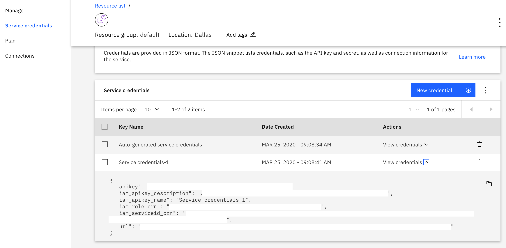

# COVID Crisis Communications Starter Kit

This solution starter was created by technologists from IBM. Translations are available: [JP](/README_JP.md)

## Authors

- [Aritra Chowdhury]()
- [Sumit Chakraborty]()
- [Sukanta Banerjee]()

## Contents

1. [Overview](#overview)
2. [Video](#video)
3. [The idea](#the-idea)
4. [How it works](#how-it-works)
5. [Diagrams](#diagrams)
6. [Documents](#documents)
7. [Datasets](#datasets)
8. [Technology](#technology)
9. [Getting started](#getting-started)
10. [Resources](#resources) 11.[License](#license)

## Overview

### What's the problem?

In times of crisis, communications systems are often overwhelmed with people trying to find basic information about testing, symptoms, community response, and other resources. When communication lines get clogged, people who need real help can't get through. Chatbots help respond to tens, even hundreds, of thousands of messages a day.

### How can technology help ?

Whether via text, phone, websites, or communication apps, conversing with chatbots and other AI-enabled resources can play a critical role in helping communities quickly understand crucial information and free up customer service resources to focus on higher-level issues.

IBM Watson Assistant service helps you build, train, and deploy conversational interactions into any application, device, or channel. Creating a chatbot using Watson Assistant can help address the issues that our users face while trying to gather accurate, relevant information. Whether you're trying to learn the latest news about Covid-19 or learn where there's testing in your area, a chatbot can play a major role in helping communities quickly understand crucial information and free up customer service resources to focus on higher-level issues.

## Video

[](https://youtu.be/26Yk6VPLq10)

## The idea

COVID-19 has citizens looking for answers about symptoms and testing sites as well as current status of schools, transportation, and other public services. Using Watson Assistant, this Call for Code has designed a virtual assistant to respond to common questions about COVID-19, scan COVID-19 news articles using Watson Discovery and respond to COVID statistics inquires with data from trusted sources and capture the untrained data and store in the Cloudant DB for future anlaysis and auto training of modules used in the assistant.

It can:

- Respond by sharing consistent, accurate COVID-19 information
- Help citizens quickly and easily access the latest information through their channel of choice – only text collaborative tool
- Free valuable resources by automating answers to common COVID-19 questions
- Dynamically update information with the latest developments and recommendations

The challenge for you is to build out from this framework to create a more complete solution.

## How it works

## Diagrams

### Website integration with COVID-19 crisis communication chatbot


1. User visits a website with the COVID-19 chatbot and asks a question.
2. Node.js web server calls the Watson Assistant service hosted in IBM Cloud.
3. Watson Assistant uses natural language understanding and machine learning to extract entities and intents of the user question.
4. Source COVID-19 FAQ information from trusted CDC data.
5. Watson Assistant invokes an OpenWhisk open source powered IBM Cloud Function.
6. IBM Cloud Function calls the Watson Discovery service running in IBM Cloud.
7. Watson Discovery scans news articles and responds with relevant articles.
8. Watson Assistant invokes an OpenWhisk open source powered IBM Cloud Function.
9. IBM Cloud Function calls the COVID-19 API to get statistics.
10. Watson Assistant replies to the user inquiry.
11. Node.js web server displays the chat answer to the user.

## Documents

### Trusted sources for COVID-19 information

- [CDC COVID-19 FAQ](https://www.cdc.gov/coronavirus/2019-ncov/faq.html)

## Datasets

- [covid19api](https://covid19api.com/)

## Technology

### IBM technology

- [IBM Watson Assistant](https://www.ibm.com/cloud/watson-assistant/)
- [Watson Discovery](https://www.ibm.com/cloud/watson-discovery)
- [Toolchain](https://cloud.ibm.com/devops/toolchains/)
- [Cloudant](https://cloud.ibm.com/catalog/services/cloudant/)
- [IBM Cloud Functions](https://cloud.ibm.com/functions/)

## Learning objectives

In this tutorial, you will:

1. Learn how to create a simple Node.js application.
2. Connect the application to a chatbot using the IBM Watson Assistant APIs.
3. Test and run the application locally.
4. Deploy the application on IBM Cloud as a Cloud Foundry application.

Here is a demo of the final application:

## Prerequisites

1. Sign up for an [IBM Cloud account](https://www.ibm.com/account/reg/us-en/signup?formid=urx-42793&eventid=cfc-2020?cm_mmc=OSocial_Blog-_-Audience+Developer_Developer+Conversation-_-WW_WW-_-cfc-2020-ghub-starterkit-communication_ov75914&cm_mmca1=000039JL&cm_mmca2=10008917).
1. Download the [IBM Cloud CLI](https://cloud.ibm.com/docs/cli/index.html#overview). You will use it to push your Node.js application to the cloud.
1. You should already have a Watson Assistant service created when you deployed the COVID bot. You need to get the credentials from that chatbot to use in your Node.js application:
   - Log in to your IBM Cloud account.
   - Go to resources and open your Watson Assistant service instance.
   - You will be taken to Watson Assistant launch page. Click **Service Credentials** to view the service credentials.
     
   - You will use these credentials to populate the `.env` file when configuring the application below. Copy and save the JSON somewhere or leave this window open.

## Estimated **time**

This tutorial will take you about 30 minutes to complete.

## Steps

The following steps assume that you have created an assistant, imported the COVID skills, and have the Watson Assistant service credentials available.

## Configuring the application

1. Clone the repository and cd into `crisis-communication-chat-bot`.

2. Copy the _.env.example_ file to a file called _.env_

   ```
   cp .env.example .env
   ```

3. Open the _.env_ file and add the service credentials that you obtained in the previous step.

   The following example _.env_ file configures the `apikey` and `url` for a Watson Assistant service instance hosted in the US East region:

   ```
   ASSISTANT_IAM_APIKEY=X4rbi8vwZmKpXfowaS3GAsA7vdy17Qhxxxxxxxx
   ASSISTANT_URL=https://gateway-wdc.watsonplatform.net/assistant/api
   ```

   - If your service instance uses `username` and `password` credentials, add the `ASSISTANT_USERNAME` and `ASSISTANT_PASSWORD` variables to the _.env_ file.

   The following example _.env_ file configures the `username`, `password`, and `url` for a Watson Assistant service instance hosted in the US South region:

   ```
   ASSISTANT_USERNAME=522be-7b41-ab44-dec3-xxxxxxxx
   ASSISTANT_PASSWORD=A4Z5BdGENxxxx
   ASSISTANT_URL=https://gateway.watsonplatform.net/assistant/api
   ```

   However, if your credentials contain an IAM API key, copy the `apikey` and `url` to the relevant fields.

   ```JSON
     {
       "apikey": "ca2905e6-7b5d-4408-9192-xxxxxxxx",
       "iam_apikey_description": "Auto generated apikey during resource-key ...",
       "iam_apikey_name": "auto-generated-apikey-62b71334-3ae3-4609-xxxxxxxx",
       "iam_role_crn": "crn:v1:bluemix:public:iam::::serviceRole:Manager",
       "iam_serviceid_crn": "crn:v1:bluemix:public:iam...",
       "url": "https://gateway-syd.watsonplatform.net/assistant/api"
     }
   ```

   ```
    ASSISTANT_IAM_APIKEY=ca2905e6-7b5d-4408-9192-xxxxxxxx
   ```

4. Add the `ASSISTANT_ID` to the previous properties:

   ```
   ASSISTANT_ID=522be-7b41-ab44-dec3-xxxxxxxx
   ```

## Running locally

1. Install the dependencies:

   ```
   npm install
   ```

1. Run the application:

   ```
   npm start
   ```

1. View the application in a browser at `localhost:3000`.

## Deploy to IBM Cloud as a Cloud Foundry application

1. Log in to IBM Cloud with the [IBM Cloud CLI](https://cloud.ibm.com/docs/cli/index.html#overview):

   ```
   ibmcloud login
   ```

1. Target a Cloud Foundry organization and space:

   ```
   ibmcloud target --cf
   ```

1. Edit the _manifest.yml_ file. Change the **name** field to something unique.  
   For example, `- name: covid-crisis-communication-chatbot-yourname`.

1. Deploy the application

   ```
   ibmcloud app push
   ```

1. View the application online at the app URL. For example, [covid-crisis-communication-chatbot-yourname.mybluemix.net](covid-crisis-communication-chatbot-yourname.mybluemix.net).

## Disclosures

This tool is intended to provide information based on currently available CDC and other public information to help you make decisions about seeking appropriate medical care. This system is not intended for the diagnosis or treatment of disease or other conditions, including COVID-19, and you should not provide any personally identifying or private health information.

This Watson Assistant bot is populated with data that is sourced from the following resources:

- Most static responses provide information found on the CDC's COVID FAQ Page: https://www.cdc.gov/coronavirus/2019-ncov/faq.html
- Dynamic infection and death counts are sourced from Johns Hopkins University via the following API: https://www.covid19api.com/
- Dynamic news stories are sourced from Watson Discovery's news feed. Additional information on that service can be found here: https://www.ibm.com/watson/services/discovery-news/

Dynamic news stories are sourced from Watson Discovery's Additional Source. Additional information on that service can be found here: https://www.cdc.gov/coronavirus/2019-ncov/

Dynamic news stories are sourced from Watson Discovery's Additional Source. Additional information on that service can be found here: https://www.who.int/emergencies/diseases/novel-coronavirus-2019/

Dynamic news stories are sourced from Watson Discovery's Additional Source. Additional information on that service can be found here: https://www.worldometers.info/coronavirus/

## License

This solution starter is made available under the [Apache 2 License](LICENSE).
